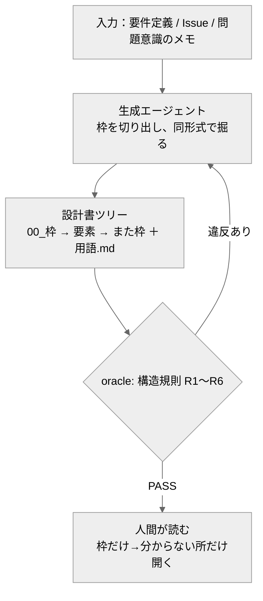

# fractal-spec-agent

要件・Issue・問題意識から、**フラクタル構造の設計書**（枠1枚→要素→また枠）と**学習の層**（用語集）を生成するエージェント ＋ 構造を機械検査するオラクル。
Generates fractal design docs (one frame → elements → frames again) with a built-in learning layer, verified by a deterministic document-structure oracle.

## 背景

AIは一晩で大量に作れるが、人間が一度に把握できる量は変わらない。
この乖離を埋めるのは「ズームできる設計書」——最上位の1枚で全体が見え、
分からない要素だけを開くと、同じ形式で詳細が展開する。覚えた枝は開かなくてよい。
開く場所が減っていくこと自体が、理解の進捗になる。

## 中心の考え方

「分かりやすさ」は主観でも、**分かりやすさを支える構造は機械検査できる**——
ただし保証するのは**構造まで**。内容の正しさ・分割のセンスは保証しない（見本の要素7_限界に明記）。
行数などの閾値は編集上の既定値（`eval/corpus/rules.json` で変更可能）：

| 規則 | 内容 | 根拠 |
|---|---|---|
| R1 | 1ファイル45行以内 | 1画面＝認知の1単位 |
| R2 | 枠の表は2〜9行 | 人が保持できるチャンク数（7±2） |
| R3 | 全ノード同形式 | 形式を学ぶのは1回でよくなる |
| R4/R5 | リンク切れ・孤児ゼロ | ズームの経路が壊れない |
| R6 | 専門用語は用語集に定義必須 | 設計書が学習を内蔵する |

## クイックスタート

必要なもの：Python 3 のみ。**リポジトリのルートで実行**。

```bash
python eval/oracle.py            # お手本の設計書を採点 → PASS
python eval/oracle.py --selftest # オラクル自身を検証（15項目） → PASS
python eval/oracle.py --check <フォルダ>   # 自分の設計書を採点
```

## 見本

`samples/reference/` が実物です。`00_枠.md` から開いてください。
（この見本の題材は自己言及——このエージェント自身の設計書です）

## しくみ



## オラクルの信頼性（--selftest）

- お手本と最小ツリーが合格すること（誤検出ゼロ）
- わざと壊した見本6種（長すぎ・枠過大・戻るリンク欠落・リンク切れ・孤児・用語未定義）を、**それぞれ正しい規則として**検出すること（1見本1違反で判別まで検証）

## 系譜

自作AIエージェント集（評価駆動開発の実証）の一つ。オラクル種別＝**文書構造検査**（新型）。
発想の実証実験：この構造の設計書は、人間の怒りと修正の往復から生まれた実運用の型を一般化したもの。
