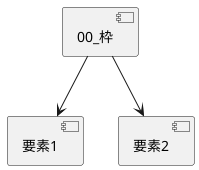

# 見本 — 枠

**読み方**：枠だけ読めば全体。用語は [用語](./02_学習/用語.md)。
入力の点検は [入力の不足](./00_入力の不足.md)。
AIの推定は [推定](./03_推定/推定.md)。

| # | 要素 | 一言 | 詳細 |
|---|---|---|---|
| 1 | 目的 | テスト用の最小ツリー | [開く](./01_設計/要素1.md) |
| 2 | 出力 | 2要素で規則を満たす | [開く](./01_設計/要素2.md) |

