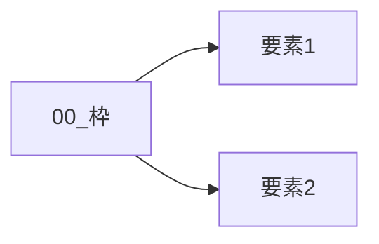

# 見本 — 枠

**読み方**：枠だけ読めば全体。用語は [用語](./用語.md)。

| # | 要素 | 一言 | 詳細 |
|---|---|---|---|
| 1 | 目的 | テスト用の最小ツリー | [開く](./要素1.md) |
| 2 | 出力 | 2要素で規則を満たす | [開く](./要素2.md) |

```mermaid
flowchart LR
  A["00_枠"] --> B["要素1"]
  A --> C["要素2"]
```
