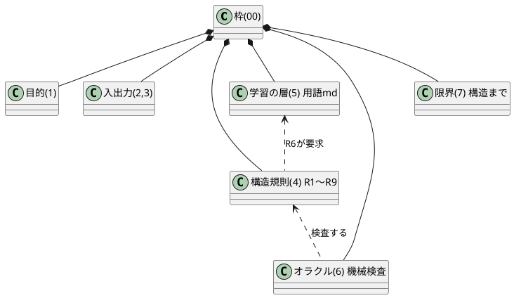

# フラクタル設計書ジェネレータ — 枠（この1枚で全体）

**読み方**：この枠だけ読めば全体が分かる。分からない行だけ、リンクの先を開く。
どの深さでも同じ形式（枠→要素）が繰り返される。未知の言葉は [用語](./02_学習/用語.md) にある。
入力そのものに何が書かれていなかったかは [入力の不足](./00_入力の不足.md) にある。
無かった観点をAIが推定した候補（未確認）は [推定](./03_推定/推定.md) にある。

**置き場所**：設計の本体は `01_設計/`、学習の層は `02_学習/`、AIの推定は `03_推定/`。この枠が入口。

| # | 要素 | 一言でいうと | 詳細 |
|---|---|---|---|
| 1 | 目的 | AIが作る量と人間の認知の乖離を、ズーム可能な設計書で埋める | [開く](./01_設計/要素1_目的.md) |
| 2 | 入力 | 要件定義・問題意識（GitHub Issue程度の粗さでよい） | [開く](./01_設計/要素2_入力.md) |
| 3 | 出力 | この見本と同じ構造の設計書一式＋学習の層 | [開く](./01_設計/要素3_出力.md) |
| 4 | 構造規則 | 「枠1枚→要素→また枠」のフラクタル。1枚は1画面以内 | [開く](./01_設計/要素4_構造規則.md) |
| 5 | 学習の層 | 読者が知らないはずの用語を検出し、定義と深掘り先を付ける | [開く](./01_設計/要素5_学習の層.md) |
| 6 | オラクル | 構造規則を機械検査。壊した見本を検出できるかで自己検証 | [開く](./01_設計/要素6_オラクル.md) |
| 7 | 限界 | 内容の正しさまでは保証しない（構造の正しさまで） | [開く](./01_設計/要素7_限界.md) |

**現在地**：試作サンプル（2026-08-10・手作り）。この見本が「出力のお手本（golden）」になる。

## 全体構成図（骨組みと部分の関係）

